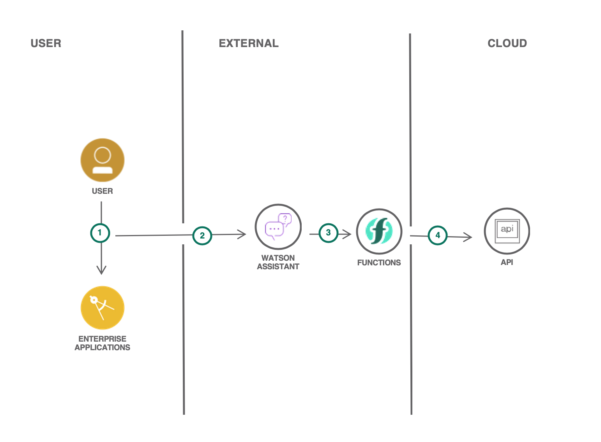
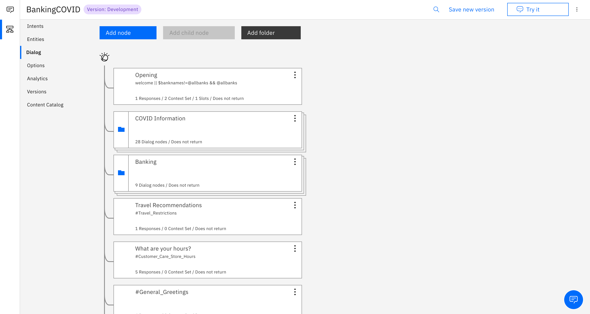
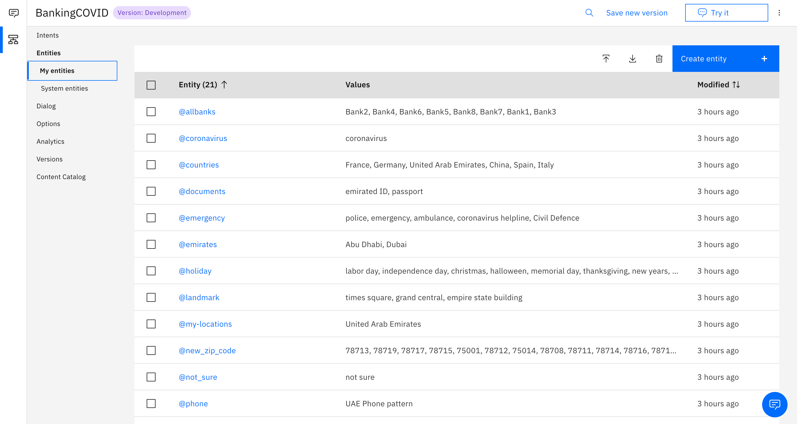
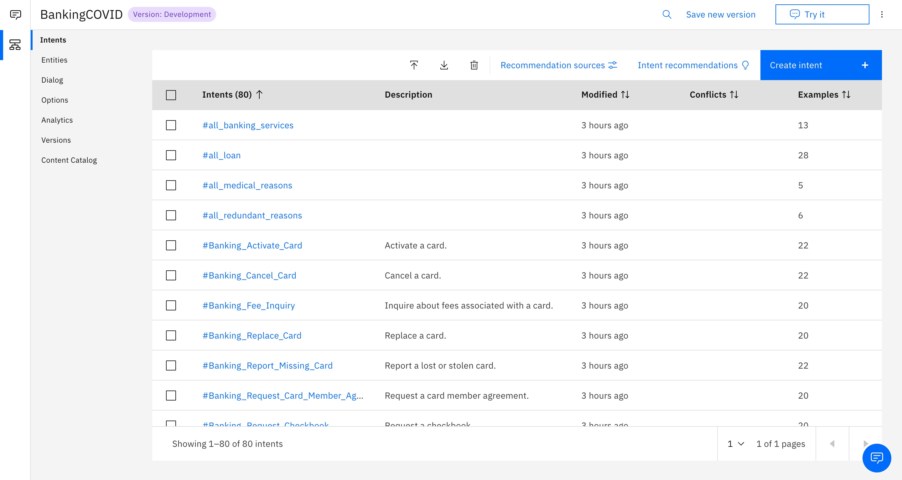

# COVID-19 Banking Based UAE Chatbot 

As we all know, COVID-19 has taken a toll over many enterprises and their customers as well. During this time many customers would want the help of customer support tools to navigate through their options and get the required help for their queries in Arabic and English. In order to address this, COVID-19 Banking Assistant can serve as an asset for banking customers, helping them with their bank related queries with COVID-19 information embedded in the chatbot as well. This can be leveraged as a one-stop-shop chatbot providing users with comprehensive information regarding the current COVID-19 pandemic as well as answering their questions revolving around the financial relief loans provided by banks. 

## Authors

* Mridul Bhandari - IBM
* Mohammad Fawaz Siddiqi - IBM
* Sidra Ahmed - IBM

## Demo

http://covid-19-bank-chatbot.mybluemix.net

## Blog

https://medium.com/ibm-watson/building-a-covid-19-virtual-banking-assistant-cb4252dc1bcc

## Technologies Used

-   Watson Assistant - for leveraging the chatbot itself.
-   IBM Cloud Functions - for connecting Web Application UI to Watson Assistant

## Architecture Diagram

1- User can interact with the assistant through web or mobile application.  
2- The application calls Watson Assistant that is hosted on IBM Cloud.  
3- Watson Assistant makes calls to Cloud Functions to extract latest information about COVID-19 cases.  
4- Cloud Functions makes calls to COVID-19 cases API from Johns Hopkins CSSE.

## Sample Inputs

- Number of Cases
- Open Shops 
- Testing/Screening Centers
- Self-screening
- Banking Services
  - Provides bank names and their services after choosing the bank

#### Bot Controls
- Traversing back
  - "Bank Menu" - after a banking service has been viewed 
  - "Main Menu" - to go back to the starting of the chatbot after using a particular service

## Steps

1. [Set up an instance of Watson Assistant](#1-set-up-an-instance-of-watson-assistant).
2. [Retrieve Intregation ID, Region & Service Instance ID from the Watson Assistant service](#2-retrieve-intregation-id,-region-&-service-instance-id-from-the-watson-assistant-service).
3. [Run the server](#3-run-the-server).

### 1. Set up an instance of Watson Assistant

Log in to IBM Cloud and provision a Watson Assistant instance.

1. Provision an instance of **Watson Assistant** from the [IBM Cloud catalog](https://cloud.ibm.com/catalog/services/watson-assistant).
1. Launch the Watson Assistant service.
1. [Create an **Assistant**](https://cloud.ibm.com/docs/assistant?topic=assistant-assistant-add).
1. [Add a dialog skill](https://cloud.ibm.com/docs/assistant?topic=assistant-skill-dialog-add) to the **Assistant** by importing the [`skill-BankingCOVID.json`](./Watson-Assistant-Dialog-Skill/skill-BankingCOVID.json) file.
1. Go back to All Assistants page, open **Settings** from the action menu ( **`⋮`** ) and click on **API Details**.
1. Note the **Assistant ID** and **API Key**. From the **Assistant URL**, make note of the base URL/domain (e.g., `https://api.us-south.assistant.watson.cloud.ibm.com` or `https://api.eu-gb.assistant.watson.cloud.ibm.com`) but do not include the directory/path.
1. Go to **Preview Link** to get a link to test and verify the dialog skill.

### 2. Retrieve Intregation ID, Region & Service Instance ID from the Watson Assistant service

To connect Watson Assistant to Web Application UI Integration ID, Region & Service Instance are required. Go to the Assistant and add Web Chat Integration. Click on Web Chat under saved Integrations and scroll to Add the chat UI to your web page. Copy the Integration ID, Region & Service Instance ID.

### 3. Run the server

To set up and launch the server application:

1. Go to the `Covid-19 Bank Chatbot/index.html` directory of the cloned repo.
2. Update the `integrationID`, `region`, and `serviceInstanceID` with the values from the Web Chat Integration in Watson Assistant.
3. Edit the **name** value in the `manifest.yml` file to your application name (for example, _my-app-name_).
4. Deploy:  
        - **To run locally:**  
            1. Start the [Live Server](https://marketplace.visualstudio.com/items?itemName=ritwickdey.LiveServer) .  
            2. The server can be accessed at http://127.0.0.1:5500/index.html.  
        - **To deploy to IBM Cloud:**  
            1. Log in to your IBM Cloud account using the IBM Cloud CLI: `ibmcloud login`.  
            2. Target a Cloud Foundry org and space: `ibmcloud target --cf`.  
            3. Push the app to IBM Cloud: `ibmcloud app push`.  
            4. The server can be accessed at the URL shown in the console (`routes`) after the app successful uploads and starts (for example,  http://covid-19-bank-chatbot.mybluemix.net).

## Resources

- [IBM Cloud](https://www.ibm.com/cloud)
- [Watson Assistant](https://cloud.ibm.com/docs/assistant?topic=assistant-getting-started)

## Working Example

## Screenshots

### Chatbot Integrated in Web UI

### Watson Assistant Dialog Skills

